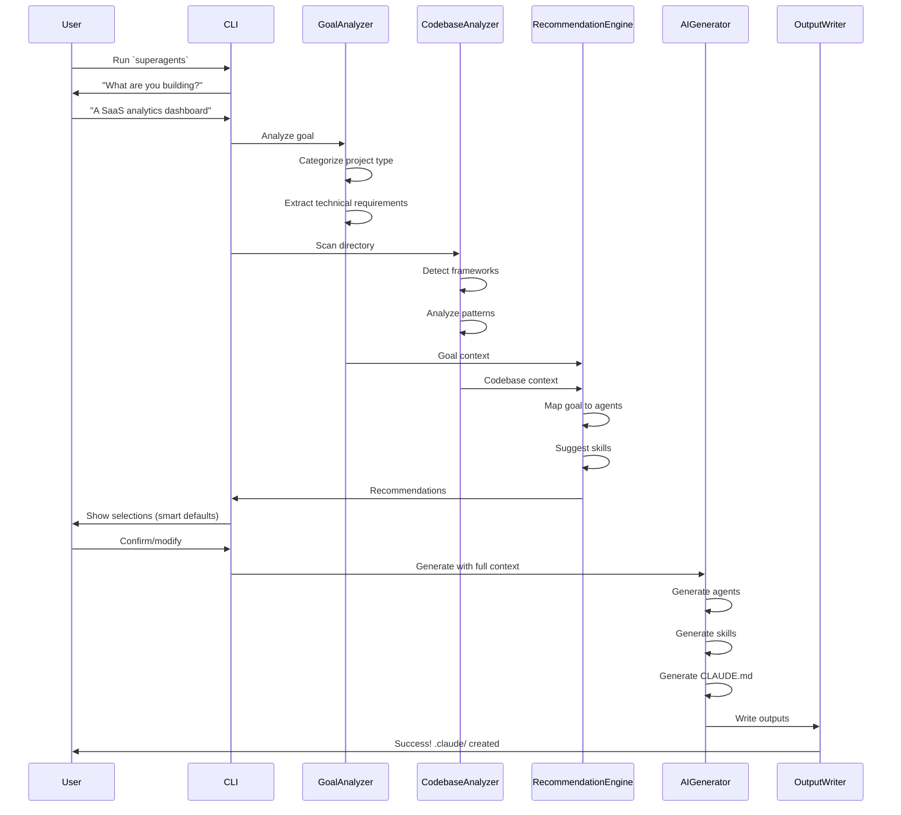

# SuperAgents - Technical Architecture

> **Enhanced Claude Code configuration generator with goal-aware intelligence**

---

## Table of Contents

1. [Executive Summary](#executive-summary)
2. [System Architecture](#system-architecture)
3. [Core Components](#core-components)
4. [Data Flow](#data-flow)
5. [AI Prompting Strategy](#ai-prompting-strategy)
6. [File Formats](#file-formats)
7. [Detection Logic](#detection-logic)
8. [Configuration Catalog](#configuration-catalog)
9. [Implementation Details](#implementation-details)
10. [Security & Privacy](#security--privacy)

---

## Executive Summary

### What is SuperAgents?

SuperAgents is an intelligent CLI tool that generates customized Claude Code configurations by combining:

1. **Goal Understanding** - What you're building (your vision)
2. **Codebase Analysis** - What you have (current state)
3. **Gap Analysis** - What you need (recommended tools)

### Key Innovation: Goal-First Approach

SuperAgents asks:

> "What are you building?"

This enables:

- **Forward-looking configurations** tailored to your goals
- **Smarter agent selection** based on project type
- **Proactive skill recommendations** for what you'll need
- **Context-rich generations** that understand your vision

### Value Proposition

**Traditional Approach:**

```
Analyze code → Detect tech → Generate generic configs
```

**SuperAgents Approach:**

```
Understand goal → Analyze code → Map goal to tech needs → Generate targeted configs
```

**Result:** Configurations that help you build what you want, not just work with what you have.

---

## System Architecture

### High-Level Overview

```
┌─────────────────────────────────────────────────────────────────────┐
│                         SUPERAGENTS CLI                             │
├─────────────────────────────────────────────────────────────────────┤
│                                                                     │
│  ┌────────────────┐    ┌────────────────┐    ┌──────────────────┐  │
│  │  CLI Interface │───▶│  Goal Analyzer │───▶│ Codebase Analyzer│  │
│  │   (Prompts)    │    │   (NEW!)       │    │  (Detection)     │  │
│  └────────────────┘    └────────────────┘    └──────────────────┘  │
│         │                     │                       │             │
│         │                     ▼                       ▼             │
│         │              ┌────────────────────────────────┐           │
│         │              │   Context Builder (Unified)    │           │
│         │              │  (Goal + Code + Recommendations)│          │
│         │              └────────────────────────────────┘           │
│         │                            │                              │
│         ▼                            ▼                              │
│  ┌────────────────┐         ┌─────────────────┐                    │
│  │ Selection UI   │◀────────│ Recommendation  │                    │
│  │ (Multi-select) │         │    Engine       │                    │
│  └────────────────┘         └─────────────────┘                    │
│         │                                                           │
│         ▼                                                           │
│  ┌─────────────────────────────────────────────────────┐           │
│  │         AI Generator (Claude API)                   │           │
│  │  - Agent Generator                                  │           │
│  │  - Skill Generator                                  │           │
│  │  - Hook Generator                                   │           │
│  │  - CLAUDE.md Generator                              │           │
│  └─────────────────────────────────────────────────────┘           │
│         │                                                           │
│         ▼                                                           │
│  ┌─────────────────────────────────────────────────────┐           │
│  │         Output Writer (.claude folder)              │           │
│  └─────────────────────────────────────────────────────┘           │
│                                                                     │
└─────────────────────────────────────────────────────────────────────┘
```

### Component Interaction Flow



---

## Core Components

### 1. CLI Interface Module

**Location:** `src/cli/`

**Responsibilities:**

- Display branding and banner
- Manage interactive prompt flow
- Show progress indicators
- Handle user input validation

**Key Files:**

```typescript
// src/cli/index.ts
export async function runCLI(): Promise<void> {
  displayBanner();

  // NEW: Goal collection step
  const goal = await collectProjectGoal();

  const model = await selectModel();
  const analysis = await analyzeWithProgress();
  const recommendations = await getRecommendations(goal, analysis);
  const selections = await confirmSelections(recommendations);

  await generateWithProgress(goal, analysis, selections, model);

  displaySuccess();
}
```

```typescript
// src/cli/prompts.ts
import * as p from "@clack/prompts";

export async function collectProjectGoal(): Promise<ProjectGoal> {
  const intro = p.intro("SuperAgents - Goal-Aware Configuration Generator");

  const goalDescription = await p.text({
    message: "What are you building?",
    placeholder: "E.g., A SaaS analytics dashboard with real-time charts",
    validate: (value) => {
      if (!value) return "Please describe your project";
      if (value.length < 10) return "Please provide more detail";
    },
  });

  // Optional: Suggest category
  const suggestedCategory = await categorizeGoal(goalDescription);

  const category = await p.select({
    message: "Project type",
    options: [
      {
        value: suggestedCategory,
        label: `${suggestedCategory} (detected)`,
        hint: "Recommended",
      },
      { value: "saas-dashboard", label: "SaaS Dashboard" },
      { value: "ecommerce", label: "E-Commerce Platform" },
      { value: "content-platform", label: "Content Platform" },
      { value: "api-service", label: "API Service" },
      { value: "custom", label: "Custom" },
    ],
    initialValue: suggestedCategory,
  });

  return {
    description: goalDescription as string,
    category: category as GoalCategory,
    timestamp: new Date().toISOString(),
  };
}
```

**Banner Design:**

```typescript
// src/cli/banner.ts
export const BANNER = `
╔═══════════════════════════════════════════════════════════════╗
║                                                               ║
║   ███████╗██╗   ██╗██████╗ ███████╗██████╗                    ║
║   ██╔════╝██║   ██║██╔══██╗██╔════╝██╔══██╗                   ║
║   ███████╗██║   ██║██████╔╝█████╗  ██████╔╝                   ║
║   ╚════██║██║   ██║██╔═══╝ ██╔══╝  ██╔══██╗                   ║
║   ███████║╚██████╔╝██║     ███████╗██║  ██║                   ║
║   ╚══════╝ ╚═════╝ ╚═╝     ╚══════╝╚═╝  ╚═╝                   ║
║                                                               ║
║   █████╗  ██████╗ ███████╗███╗   ██╗████████╗███████╗         ║
║  ██╔══██╗██╔════╝ ██╔════╝████╗  ██║╚══██╔══╝██╔════╝         ║
║  ███████║██║  ███╗█████╗  ██╔██╗ ██║   ██║   ███████╗         ║
║  ██╔══██║██║   ██║██╔══╝  ██║╚██╗██║   ██║   ╚════██║         ║
║  ██║  ██║╚██████╔╝███████╗██║ ╚████║   ██║   ███████║         ║
║  ╚═╝  ╚═╝ ╚═════╝ ╚══════╝╚═╝  ╚═══╝   ╚═╝   ╚══════╝         ║
║                                                               ║
║  Goal-Aware Claude Code Configuration Generator               ║
║                                                               ║
╚═══════════════════════════════════════════════════════════════╝
`;
```

---

### 2. Goal Analyzer (NEW Component)

**Location:** `src/analyzer/goal-analyzer.ts`

**Responsibilities:**

- Parse user's project description
- Categorize project type
- Extract technical requirements
- Map to recommended agents and skills

**Core Types:**

```typescript
export interface ProjectGoal {
  // User input
  description: string; // "A SaaS analytics dashboard"
  category: GoalCategory; // 'saas-dashboard'

  // Analyzed data
  technicalRequirements: TechRequirement[];
  suggestedAgents: AgentSuggestion[];
  suggestedSkills: SkillSuggestion[];

  // Metadata
  timestamp: string;
  confidence: number; // 0-1, how confident in categorization
}

export type GoalCategory =
  | "saas-dashboard"
  | "ecommerce"
  | "content-platform"
  | "api-service"
  | "mobile-app"
  | "cli-tool"
  | "data-pipeline"
  | "auth-service"
  | "custom";

export interface TechRequirement {
  category:
    | "frontend"
    | "backend"
    | "database"
    | "auth"
    | "payments"
    | "deployment";
  description: string;
  priority: "required" | "recommended" | "optional";
  suggestedTechnologies: string[];
}

export interface AgentSuggestion {
  name: string; // 'frontend-engineer'
  reason: string; // Why this agent is recommended
  priority: number; // 1-10
}

export interface SkillSuggestion {
  name: string; // 'nextjs'
  reason: string;
  priority: number;
}
```

**Implementation:**

```typescript
// src/analyzer/goal-analyzer.ts
export class GoalAnalyzer {
  constructor(private anthropic: Anthropic) {}

  async analyzeGoal(
    description: string,
    category: GoalCategory,
  ): Promise<ProjectGoal> {
    // Use Claude to analyze the goal description
    const analysis = await this.anthropic.messages.create({
      model: "claude-sonnet-4-5-20250929",
      max_tokens: 2000,
      messages: [
        {
          role: "user",
          content: `Analyze this project goal and extract technical requirements:

Goal: "${description}"
Category: ${category}

Return a JSON object with:
{
  "technicalRequirements": [
    {
      "category": "frontend" | "backend" | "database" | "auth" | "payments" | "deployment",
      "description": "Brief description",
      "priority": "required" | "recommended" | "optional",
      "suggestedTechnologies": ["tech1", "tech2"]
    }
  ],
  "suggestedAgents": [
    {
      "name": "agent-name",
      "reason": "Why this agent is needed",
      "priority": 1-10
    }
  ],
  "suggestedSkills": [
    {
      "name": "skill-name",
      "reason": "Why this skill is needed",
      "priority": 1-10
    }
  ],
  "confidence": 0.0-1.0
}

Focus on practical, actionable recommendations.`,
        },
      ],
    });

    const parsed = JSON.parse(analysis.content[0].text);

    return {
      description,
      category,
      ...parsed,
      timestamp: new Date().toISOString(),
    };
  }

  // Fallback: Rule-based categorization if API fails
  categorizeGoal(description: string): GoalCategory {
    const lower = description.toLowerCase();

    if (
      lower.includes("dashboard") ||
      lower.includes("analytics") ||
      lower.includes("saas")
    ) {
      return "saas-dashboard";
    }
    if (
      lower.includes("ecommerce") ||
      lower.includes("shop") ||
      lower.includes("store")
    ) {
      return "ecommerce";
    }
    if (
      lower.includes("blog") ||
      lower.includes("cms") ||
      lower.includes("content")
    ) {
      return "content-platform";
    }
    if (
      lower.includes("api") ||
      lower.includes("backend") ||
      lower.includes("rest")
    ) {
      return "api-service";
    }
    if (
      lower.includes("mobile") ||
      lower.includes("app") ||
      lower.includes("ios") ||
      lower.includes("android")
    ) {
      return "mobile-app";
    }
    if (
      lower.includes("cli") ||
      lower.includes("command") ||
      lower.includes("terminal")
    ) {
      return "cli-tool";
    }
    if (
      lower.includes("pipeline") ||
      lower.includes("etl") ||
      lower.includes("data")
    ) {
      return "data-pipeline";
    }

    return "custom";
  }
}
```

---

### 3. Codebase Analyzer

**Location:** `src/analyzer/codebase-analyzer.ts`

**Responsibilities:**

- Detect project type and framework
- Scan file structure
- Identify dependencies
- Analyze existing patterns
- Sample representative files

**Core Types:**

```typescript
export interface CodebaseAnalysis {
  // Basic info
  projectRoot: string;
  projectType: ProjectType;
  language: ProgrammingLanguage;
  framework: Framework | null;

  // Dependencies
  dependencies: Dependency[];
  devDependencies: Dependency[];

  // Structure
  fileStructure: FileNode[];
  totalFiles: number;
  totalLines: number;

  // Patterns
  detectedPatterns: Pattern[];

  // Recommendations
  suggestedSkills: string[];
  suggestedAgents: string[];

  // Existing configs
  existingClaudeConfig: ExistingClaudeConfig | null;
  mcpServers: MCPServer[];

  // Metadata
  analyzedAt: string;
  analysisTimeMs: number;
}

export type ProjectType =
  | "nextjs"
  | "react"
  | "vue"
  | "node"
  | "python"
  | "go"
  | "rust"
  | "java"
  | "unknown";

export type ProgrammingLanguage =
  | "typescript"
  | "javascript"
  | "python"
  | "go"
  | "rust"
  | "java"
  | "csharp"
  | "php"
  | "ruby";

export interface Dependency {
  name: string;
  version: string;
  category: DependencyCategory;
}

export type DependencyCategory =
  | "framework"
  | "ui"
  | "database"
  | "orm"
  | "auth"
  | "payments"
  | "testing"
  | "build"
  | "other";

export interface Pattern {
  type: PatternType;
  paths: string[];
  confidence: number;
  description: string;
}

export type PatternType =
  | "api-routes"
  | "server-actions"
  | "components"
  | "services"
  | "models"
  | "controllers"
  | "middleware"
  | "hooks"
  | "utils";

export interface FileNode {
  path: string;
  type: "file" | "directory";
  size?: number;
  children?: FileNode[];
}
```

**Implementation:**

```typescript
// src/analyzer/codebase-analyzer.ts
import { glob } from "glob";
import * as fs from "fs-extra";
import * as path from "path";

export class CodebaseAnalyzer {
  async analyze(projectRoot: string): Promise<CodebaseAnalysis> {
    const startTime = Date.now();

    // Parallel analysis
    const [
      projectType,
      language,
      framework,
      dependencies,
      fileStructure,
      patterns,
      existingConfig,
      mcpServers,
    ] = await Promise.all([
      this.detectProjectType(projectRoot),
      this.detectLanguage(projectRoot),
      this.detectFramework(projectRoot),
      this.analyzeDependencies(projectRoot),
      this.buildFileStructure(projectRoot),
      this.detectPatterns(projectRoot),
      this.checkExistingClaudeConfig(projectRoot),
      this.detectMCPServers(projectRoot),
    ]);

    const suggestedSkills = this.inferSkills(dependencies, framework, patterns);
    const suggestedAgents = this.inferAgents(patterns, projectType);

    return {
      projectRoot,
      projectType,
      language,
      framework,
      dependencies: dependencies.production,
      devDependencies: dependencies.development,
      fileStructure,
      totalFiles: this.countFiles(fileStructure),
      totalLines: await this.countLines(projectRoot),
      detectedPatterns: patterns,
      suggestedSkills,
      suggestedAgents,
      existingClaudeConfig: existingConfig,
      mcpServers,
      analyzedAt: new Date().toISOString(),
      analysisTimeMs: Date.now() - startTime,
    };
  }

  private async detectProjectType(root: string): Promise<ProjectType> {
    // Check for framework-specific files
    if (
      (await fs.pathExists(path.join(root, "next.config.js"))) ||
      (await fs.pathExists(path.join(root, "next.config.mjs"))) ||
      (await fs.pathExists(path.join(root, "next.config.ts")))
    ) {
      return "nextjs";
    }

    const pkg = await this.readPackageJson(root);
    if (pkg) {
      if (pkg.dependencies?.["next"]) return "nextjs";
      if (pkg.dependencies?.["react"]) return "react";
      if (pkg.dependencies?.["vue"]) return "vue";
      if (pkg.dependencies?.["express"] || pkg.dependencies?.["fastify"])
        return "node";
    }

    if (await fs.pathExists(path.join(root, "requirements.txt")))
      return "python";
    if (await fs.pathExists(path.join(root, "go.mod"))) return "go";
    if (await fs.pathExists(path.join(root, "Cargo.toml"))) return "rust";
    if (await fs.pathExists(path.join(root, "pom.xml"))) return "java";

    return "unknown";
  }

  private async analyzeDependencies(root: string): Promise<{
    production: Dependency[];
    development: Dependency[];
  }> {
    const pkg = await this.readPackageJson(root);
    if (!pkg) return { production: [], development: [] };

    const categorize = (name: string): DependencyCategory => {
      // UI libraries
      if (["react", "vue", "@angular/core", "svelte"].includes(name))
        return "framework";
      if (["tailwindcss", "@shadcn/ui", "styled-components"].includes(name))
        return "ui";

      // Database
      if (
        ["postgres", "mysql", "mongodb", "redis"].some((db) =>
          name.includes(db),
        )
      )
        return "database";

      // ORM
      if (["prisma", "drizzle-orm", "typeorm", "sequelize"].includes(name))
        return "orm";

      // Auth
      if (
        ["next-auth", "@clerk/nextjs", "@supabase/auth"].some((auth) =>
          name.includes(auth),
        )
      )
        return "auth";

      // Payments
      if (
        ["stripe", "@stripe/stripe-js", "paypal"].some((pay) =>
          name.includes(pay),
        )
      )
        return "payments";

      // Testing
      if (["vitest", "jest", "playwright", "cypress"].includes(name))
        return "testing";

      // Build tools
      if (["vite", "webpack", "esbuild", "turbo"].includes(name))
        return "build";

      return "other";
    };

    const production = Object.entries(pkg.dependencies || {}).map(
      ([name, version]) => ({
        name,
        version: version as string,
        category: categorize(name),
      }),
    );

    const development = Object.entries(pkg.devDependencies || {}).map(
      ([name, version]) => ({
        name,
        version: version as string,
        category: categorize(name),
      }),
    );

    return { production, development };
  }

  private async detectPatterns(root: string): Promise<Pattern[]> {
    const patterns: Pattern[] = [];

    // API routes (Next.js)
    const apiRoutes = await glob("**/app/**/route.{ts,js}", { cwd: root });
    if (apiRoutes.length > 0) {
      patterns.push({
        type: "api-routes",
        paths: apiRoutes,
        confidence: 1.0,
        description: "Next.js App Router API routes",
      });
    }

    // Server actions
    const serverActions = await glob("**/*.{ts,js}", {
      cwd: root,
      ignore: ["node_modules/**", ".next/**"],
    });

    // Check files for 'use server' directive
    const actionFiles: string[] = [];
    for (const file of serverActions.slice(0, 100)) {
      // Sample first 100
      const content = await fs.readFile(path.join(root, file), "utf-8");
      if (
        content.includes("'use server'") ||
        content.includes('"use server"')
      ) {
        actionFiles.push(file);
      }
    }

    if (actionFiles.length > 0) {
      patterns.push({
        type: "server-actions",
        paths: actionFiles,
        confidence: 1.0,
        description: "Next.js Server Actions",
      });
    }

    // React components
    const components = await glob("**/components/**/*.{tsx,jsx}", {
      cwd: root,
    });
    if (components.length > 0) {
      patterns.push({
        type: "components",
        paths: components,
        confidence: 1.0,
        description: "React components",
      });
    }

    return patterns;
  }

  private inferSkills(
    deps: { production: Dependency[]; development: Dependency[] },
    framework: Framework | null,
    patterns: Pattern[],
  ): string[] {
    const skills = new Set<string>();

    // Framework-based
    if (framework) skills.add(framework);

    // Dependency-based
    for (const dep of [...deps.production, ...deps.development]) {
      if (dep.name === "typescript") skills.add("typescript");
      if (dep.name === "tailwindcss") skills.add("tailwind");
      if (dep.name === "@supabase/supabase-js") skills.add("supabase");
      if (dep.name === "stripe") skills.add("stripe");
      if (dep.name.startsWith("prisma")) skills.add("prisma");
      if (dep.name === "drizzle-orm") skills.add("drizzle");
    }

    // Pattern-based
    for (const pattern of patterns) {
      if (pattern.type === "api-routes") skills.add("api-design");
      if (pattern.type === "components") skills.add("react");
    }

    return Array.from(skills);
  }

  private inferAgents(patterns: Pattern[], projectType: ProjectType): string[] {
    const agents = new Set<string>();

    // Always useful
    agents.add("reviewer");
    agents.add("debugger");

    // Pattern-based
    if (patterns.some((p) => p.type === "components")) {
      agents.add("frontend-engineer");
    }

    if (
      patterns.some(
        (p) => p.type === "api-routes" || p.type === "server-actions",
      )
    ) {
      agents.add("backend-engineer");
    }

    // Project type based
    if (projectType === "nextjs" || projectType === "react") {
      agents.add("frontend-engineer");
    }

    return Array.from(agents);
  }
}
```

---

### 4. Recommendation Engine (NEW Component)

**Location:** `src/context/recommendation-engine.ts`

**Responsibilities:**

- Combine goal and codebase analyses
- Generate smart recommendations
- Prioritize agents and skills
- Explain recommendations to user

```typescript
export class RecommendationEngine {
  recommend(goal: ProjectGoal, codebase: CodebaseAnalysis): Recommendations {
    // Merge suggestions from both sources
    const agentScores = new Map<string, AgentScore>();
    const skillScores = new Map<string, SkillScore>();

    // Score from goal
    for (const suggestion of goal.suggestedAgents) {
      agentScores.set(suggestion.name, {
        name: suggestion.name,
        score: suggestion.priority * 10,
        reasons: [suggestion.reason],
      });
    }

    // Score from codebase
    for (const agentName of codebase.suggestedAgents) {
      const existing = agentScores.get(agentName);
      if (existing) {
        existing.score += 5;
        existing.reasons.push("Detected in codebase");
      } else {
        agentScores.set(agentName, {
          name: agentName,
          score: 5,
          reasons: ["Detected in codebase"],
        });
      }
    }

    // Same for skills...

    // Sort by score
    const agents = Array.from(agentScores.values()).sort(
      (a, b) => b.score - a.score,
    );

    const skills = Array.from(skillScores.values()).sort(
      (a, b) => b.score - a.score,
    );

    return {
      agents,
      skills,
      defaultAgents: agents.filter((a) => a.score >= 7).map((a) => a.name),
      defaultSkills: skills.filter((s) => s.score >= 7).map((s) => s.name),
    };
  }
}

interface Recommendations {
  agents: AgentScore[];
  skills: SkillScore[];
  defaultAgents: string[]; // Pre-selected
  defaultSkills: string[]; // Pre-selected
}

interface AgentScore {
  name: string;
  score: number; // 0-100
  reasons: string[];
}

interface SkillScore {
  name: string;
  score: number;
  reasons: string[];
}
```

---

### 5. AI Generator

**Location:** `src/generator/`

**Responsibilities:**

- Generate agent markdown files
- Generate skill markdown files
- Generate hooks
- Generate root CLAUDE.md

**Enhanced Context for Generation:**

```typescript
export interface GenerationContext {
  // User's vision
  goal: ProjectGoal;

  // Current state
  codebase: CodebaseAnalysis;

  // Selections
  selectedAgents: string[];
  selectedSkills: string[];
  selectedModel: "opus" | "sonnet";

  // Sampled files for context
  sampledFiles: SampledFile[];

  // Metadata
  generatedAt: string;
}
```

**Agent Generation with Goal Context:**

```typescript
// src/generator/agents.ts
export class AgentGenerator {
  async generateAgent(
    context: GenerationContext,
    agentType: string,
  ): Promise<AgentOutput> {
    const prompt = `You are generating a specialized Claude Code agent configuration.

## USER'S PROJECT GOAL
${context.goal.description}

Project Category: ${context.goal.category}

Technical Requirements:
${context.goal.technicalRequirements
  .map((req) => `- ${req.category}: ${req.description} (${req.priority})`)
  .join("\n")}

## CURRENT CODEBASE STATE
Framework: ${context.codebase.framework}
Language: ${context.codebase.language}
Dependencies: ${context.codebase.dependencies.map((d) => d.name).join(", ")}

Detected Patterns:
${context.codebase.detectedPatterns
  .map((p) => `- ${p.type}: ${p.description}`)
  .join("\n")}

## AGENT TO GENERATE
Type: ${agentType}

## TASK
Generate a complete agent markdown file that:
1. Understands the user's GOAL (what they're building)
2. Knows the CURRENT STATE (existing codebase)
3. Helps bridge the gap to achieve the goal
4. Includes goal-specific best practices
5. References relevant files and patterns from the codebase

Output format:
\`\`\`yaml
---
name: ${agentType}
description: |
  [2-3 line description with "Use when:" guidance]
tools: Read, Edit, Write, Glob, Grep, Bash
model: sonnet
skills: [comma-separated relevant skills]
---
\`\`\`

[Agent system prompt content...]

Focus on PRACTICAL, ACTIONABLE guidance for THIS specific project goal.`;

    const response = await this.anthropic.messages.create({
      model:
        context.selectedModel === "opus"
          ? "claude-opus-4-5-20251101"
          : "claude-sonnet-4-5-20250929",
      max_tokens: 4000,
      messages: [{ role: "user", content: prompt }],
    });

    return {
      filename: `${agentType}.md`,
      content: response.content[0].text,
      agentName: agentType,
    };
  }
}
```

---

### 6. Output Writer

**Location:** `src/writer/`

**Responsibilities:**

- Create `.claude/` directory structure
- Write all generated files
- Handle conflicts gracefully
- Generate summary report

```typescript
// src/writer/index.ts
export class OutputWriter {
  constructor(private projectRoot: string) {}

  async writeAll(outputs: GeneratedOutputs): Promise<WriteSummary> {
    const claudeDir = path.join(this.projectRoot, ".claude");

    // Check for existing .claude directory
    if (await fs.pathExists(claudeDir)) {
      const overwrite = await confirmOverwrite();
      if (!overwrite) {
        throw new Error("User cancelled: .claude directory already exists");
      }
      await fs.remove(claudeDir);
    }

    // Create directory structure
    await fs.ensureDir(path.join(claudeDir, "agents"));
    await fs.ensureDir(path.join(claudeDir, "skills"));
    await fs.ensureDir(path.join(claudeDir, "hooks"));

    // Write CLAUDE.md
    await fs.writeFile(
      path.join(claudeDir, "CLAUDE.md"),
      outputs.claudeMd,
      "utf-8",
    );

    // Write agents
    for (const agent of outputs.agents) {
      await fs.writeFile(
        path.join(claudeDir, "agents", agent.filename),
        agent.content,
        "utf-8",
      );
    }

    // Write skills
    for (const skill of outputs.skills) {
      await fs.writeFile(
        path.join(claudeDir, "skills", skill.filename),
        skill.content,
        "utf-8",
      );
    }

    // Write hooks
    if (outputs.hooks) {
      for (const hook of outputs.hooks) {
        const hookPath = path.join(claudeDir, "hooks", hook.filename);
        await fs.writeFile(hookPath, hook.content, "utf-8");
        await fs.chmod(hookPath, "755"); // Make executable
      }
    }

    // Write settings.json
    await fs.writeFile(
      path.join(claudeDir, "settings.json"),
      JSON.stringify(outputs.settings, null, 2),
      "utf-8",
    );

    return {
      totalFiles: outputs.agents.length + outputs.skills.length + 2, // +2 for CLAUDE.md and settings.json
      agents: outputs.agents.map((a) => a.agentName),
      skills: outputs.skills.map((s) => s.skillName),
      claudeDir,
    };
  }
}
```

---

## Data Flow

### Complete User Journey

```
┌─────────────────────────────────────────────────────────────────┐
│ PHASE 1: UNDERSTANDING                                          │
├─────────────────────────────────────────────────────────────────┤
│                                                                 │
│  User Input:                                                    │
│    "A SaaS analytics dashboard with real-time charts"          │
│                                                                 │
│  ↓                                                              │
│                                                                 │
│  Goal Analyzer Output:                                          │
│    Category: saas-dashboard                                     │
│    Tech Requirements:                                           │
│      - Frontend: React-based dashboard framework               │
│      - Backend: Real-time data API                             │
│      - Database: Time-series optimized storage                 │
│      - UI: Chart library integration                           │
│    Suggested Agents: frontend-engineer, backend-engineer       │
│    Suggested Skills: react, nextjs, tailwind, api-design       │
│                                                                 │
└─────────────────────────────────────────────────────────────────┘

┌─────────────────────────────────────────────────────────────────┐
│ PHASE 2: ANALYSIS                                               │
├─────────────────────────────────────────────────────────────────┤
│                                                                 │
│  Codebase Analyzer Output:                                      │
│    Project Type: nextjs                                         │
│    Language: typescript                                         │
│    Framework: Next.js 15 (App Router)                          │
│    Dependencies:                                                │
│      - next: 15.0.0                                            │
│      - react: 19.0.0                                           │
│      - tailwindcss: 3.4.0                                      │
│      - @supabase/supabase-js: 2.39.0                          │
│    Patterns:                                                    │
│      - API routes: 8 files                                     │
│      - Components: 24 files                                    │
│      - Server actions: 5 files                                 │
│    Suggested Skills: nextjs, react, typescript, tailwind       │
│    Suggested Agents: frontend-engineer, backend-engineer       │
│                                                                 │
└─────────────────────────────────────────────────────────────────┘

┌─────────────────────────────────────────────────────────────────┐
│ PHASE 3: RECOMMENDATION                                         │
├─────────────────────────────────────────────────────────────────┤
│                                                                 │
│  Recommendation Engine Output:                                  │
│                                                                 │
│  Agents (sorted by relevance):                                 │
│    ☑ frontend-engineer (score: 95)                             │
│       → Goal: Dashboard UI needed                              │
│       → Codebase: 24 components detected                       │
│                                                                 │
│    ☑ backend-engineer (score: 90)                              │
│       → Goal: Real-time API needed                             │
│       → Codebase: 8 API routes detected                        │
│                                                                 │
│    ☑ reviewer (score: 75)                                      │
│       → Best practice: Always useful                           │
│                                                                 │
│    ☐ debugger (score: 70)                                      │
│       → Best practice: Useful for troubleshooting              │
│                                                                 │
│  Skills (sorted by relevance):                                 │
│    ☑ nextjs (score: 100)                                       │
│    ☑ typescript (score: 95)                                    │
│    ☑ react (score: 90)                                         │
│    ☑ tailwind (score: 85)                                      │
│    ☑ supabase (score: 80)                                      │
│    ☐ api-design (score: 75)                                    │
│                                                                 │
└─────────────────────────────────────────────────────────────────┘

┌─────────────────────────────────────────────────────────────────┐
│ PHASE 4: GENERATION                                             │
├─────────────────────────────────────────────────────────────────┤
│                                                                 │
│  AI Generator receives unified context:                         │
│    {                                                            │
│      goal: ProjectGoal,                                         │
│      codebase: CodebaseAnalysis,                               │
│      selections: { agents: [...], skills: [...] },             │
│      model: 'sonnet'                                           │
│    }                                                            │
│                                                                 │
│  Generates:                                                     │
│    ✓ CLAUDE.md (with goal context)                            │
│    ✓ frontend-engineer.md (goal-aware)                         │
│    ✓ backend-engineer.md (goal-aware)                          │
│    ✓ reviewer.md                                               │
│    ✓ nextjs.md (project-specific)                             │
│    ✓ typescript.md                                             │
│    ✓ react.md                                                  │
│    ✓ tailwind.md                                               │
│    ✓ supabase.md                                               │
│    ✓ skill-loader.sh hook                                      │
│    ✓ settings.json                                             │
│                                                                 │
└─────────────────────────────────────────────────────────────────┘

┌─────────────────────────────────────────────────────────────────┐
│ PHASE 5: OUTPUT                                                 │
├─────────────────────────────────────────────────────────────────┤
│                                                                 │
│  Output Writer creates:                                         │
│                                                                 │
│    .claude/                                                     │
│    ├── CLAUDE.md                                               │
│    ├── settings.json                                           │
│    ├── agents/                                                 │
│    │   ├── frontend-engineer.md                                │
│    │   ├── backend-engineer.md                                 │
│    │   └── reviewer.md                                         │
│    ├── skills/                                                 │
│    │   ├── nextjs.md                                           │
│    │   ├── typescript.md                                       │
│    │   ├── react.md                                            │
│    │   ├── tailwind.md                                         │
│    │   └── supabase.md                                         │
│    └── hooks/                                                  │
│        └── skill-loader.sh                                     │
│                                                                 │
│  Summary displayed to user                                      │
│                                                                 │
└─────────────────────────────────────────────────────────────────┘
```

---

## AI Prompting Strategy

### CLAUDE.md Generation

```typescript
const CLAUDE_MD_PROMPT = `You are generating the root CLAUDE.md file for a Claude Code project.

## USER'S GOAL
${goal.description}

Category: ${goal.category}

This project aims to: ${goal.technicalRequirements.map((r) => r.description).join(", ")}

## CURRENT CODEBASE
${JSON.stringify(codebase, null, 2)}

## SELECTED CONFIGURATIONS
Agents: ${selectedAgents.join(", ")}
Skills: ${selectedSkills.join(", ")}

## TASK
Generate a comprehensive CLAUDE.md that:
1. Describes the project's GOAL and current state
2. Outlines the tech stack (detected from codebase)
3. Highlights key patterns and architecture
4. Lists available agents with when to use each
5. Lists available skills with brief descriptions
6. Includes any MCP servers detected
7. Provides quick-start guidance for common tasks

The tone should be:
- Clear and actionable
- Specific to THIS project (not generic)
- Goal-oriented (helping achieve the vision)
- Developer-friendly

Use markdown format with proper headings, code blocks, and lists.`;
```

### Agent Generation Prompt

```typescript
const AGENT_GENERATION_PROMPT = `Generate a ${agentType} agent for Claude Code.

## CONTEXT

### User's Goal
${goal.description}

The user is building: ${goal.category}

They need:
${goal.technicalRequirements.map((r) => `- ${r.description}`).join("\n")}

### Current Codebase
Framework: ${codebase.framework}
Language: ${codebase.language}

Key dependencies:
${codebase.dependencies
  .slice(0, 10)
  .map((d) => `- ${d.name}@${d.version}`)
  .join("\n")}

Detected patterns:
${codebase.detectedPatterns.map((p) => `- ${p.type}: ${p.paths.length} files`).join("\n")}

### Sample Files
${sampledFiles
  .map(
    (f) => `
File: ${f.path}
\`\`\`
${f.content}
\`\`\`
`,
  )
  .join("\n")}

## TASK

Create a ${agentType} agent that:

1. Understands the PROJECT GOAL
2. Knows the CODEBASE PATTERNS
3. Provides SPECIFIC guidance (not generic)
4. Includes EXAMPLES from or matching this project's style
5. Has CRITICAL RULES for common pitfalls

## OUTPUT FORMAT

\`\`\`yaml
---
name: ${agentType}
description: |
  [Multi-line description]
  Use when: [specific scenarios]
tools: Read, Edit, Write, Glob, Grep, Bash
model: sonnet
skills: [relevant skills from: ${selectedSkills.join(", ")}]
---
\`\`\`

[Markdown content with sections:]

# ${agentType}

You are a senior ${agentType} working on: ${goal.description}

## Project Context

[Auto-generated from codebase]

## Tech Stack

[List relevant technologies]

## Key File Locations

[Directory structure for this agent's domain]

## [Domain-Specific] Patterns

[Code examples, idioms, best practices from THIS project]

## CRITICAL Rules

1. [Numbered list of must-follow rules]

Be specific, actionable, and goal-oriented.`;
```

### Skill Generation Prompt

```typescript
const SKILL_GENERATION_PROMPT = `Generate a ${skillName} skill for Claude Code.

## CONTEXT

### Project Goal
${goal.description}

### How ${skillName} Is Used in This Project
${usageContext}

### Detected Patterns
${patterns}

### Sample Code
${sampleCode}

## TASK

Create a skill file that:
1. Provides quick-start patterns
2. Documents key concepts
3. Shows examples FROM or MATCHING this project
4. Lists common pitfalls
5. References related skills

## OUTPUT FORMAT

# ${skillName} Skill

> [Brief description of coverage]

## When to Use
[Scenarios when this skill is relevant to achieving the project goal]

## Key Concepts

[Concepts table or list]

## Project-Specific Patterns

[Patterns detected in THIS codebase, with examples]

## Code Examples

\`\`\`typescript
// Example from or matching this project's style
\`\`\`

## Common Pitfalls

- [Things to avoid]

## Related Skills

- [Other relevant skills]

Be concrete and project-specific.`;
```

---

## File Formats

### CLAUDE.md Format (Enhanced with Goal)

```markdown
# Project: [Project Name]

## Vision

[User's goal description]

**Project Type:** [Category]

**Status:** [If existing project: "Enhancing existing codebase" | If new: "Building from scratch"]

## What We're Building

[Expanded description based on goal analysis]

Key objectives:

- [Objective 1 from technical requirements]
- [Objective 2]
- [Objective 3]

## Current Tech Stack

- **Framework:** Next.js 15 (App Router)
- **Language:** TypeScript 5.x
- **Styling:** Tailwind CSS + shadcn/ui
- **Database:** Supabase (PostgreSQL)
- **Auth:** Supabase Auth
- **Deployment:** Vercel

## Project Structure
```

app/
├── (routes)/ # Main application routes
├── api/ # API routes
└── ...
components/ # Reusable components
lib/ # Utilities and helpers

```

## Detected Patterns

### API Routes
8 routes detected in `app/api/`:
- RESTful design
- Server-side validation with Zod
- Supabase client for data access

### Components
24 React components following:
- Server Components by default
- `'use client'` only when needed
- shadcn/ui component composition

## Available Agents

Use `/agent <name>` to switch to specialized agents:

- **frontend-engineer** - Building dashboard UI and components
- **backend-engineer** - API routes and server logic
- **reviewer** - Code review and best practices

## Available Skills

Use `Skill(name)` to load domain knowledge:

- **nextjs** - Next.js 15 App Router patterns
- **typescript** - TypeScript with strict mode
- **react** - React 19 patterns
- **tailwind** - Tailwind CSS and shadcn/ui
- **supabase** - Supabase client and auth

## Quick Start

### Adding a New Dashboard Feature

1. Switch to frontend-engineer: `/agent frontend-engineer`
2. Load skills: `Skill(nextjs)`, `Skill(react)`
3. Describe the feature you want to build

### Creating a New API Endpoint

1. Switch to backend-engineer: `/agent backend-engineer`
2. Load skills: `Skill(nextjs)`, `Skill(supabase)`
3. Describe the endpoint

---

Generated by SuperAgents - Goal-aware configuration for Claude Code
```

---

### Agent File Format (Goal-Aware)

```markdown
---
name: frontend-engineer
description: |
  Senior frontend engineer specializing in building dashboard UIs with React and Next.js.
  Use when: Creating components, pages, or UI features for the analytics dashboard.
tools: Read, Edit, Write, Glob, Grep, Bash
model: sonnet
skills: nextjs, react, typescript, tailwind
---

You are a senior frontend engineer working on: **A SaaS analytics dashboard with real-time charts**

## Project Context

You're building the frontend for a SaaS analytics platform. The user needs:

- Real-time data visualization
- Interactive dashboards
- Responsive design
- Fast load times

## Tech Stack

- **Framework:** Next.js 15 (App Router)
- **UI Library:** React 19
- **Styling:** Tailwind CSS + shadcn/ui
- **Charts:** (to be determined - recommend Recharts or Chart.js)
- **State:** React hooks + URL state for filters

## Key File Locations
```

app/
├── (dashboard)/
│ ├── page.tsx # Main dashboard
│ ├── analytics/ # Analytics pages
│ └── layout.tsx # Dashboard layout
components/
├── charts/ # Chart components
├── dashboard/ # Dashboard-specific components
└── ui/ # shadcn/ui components

````

## Dashboard Component Patterns

### Real-Time Data Pattern

This project will need components that update with real-time data:

```typescript
'use client';

import { useEffect, useState } from 'react';
import { createClient } from '@/lib/supabase/client';

export function RealtimeDashboard() {
  const [data, setData] = useState([]);
  const supabase = createClient();

  useEffect(() => {
    // Initial fetch
    fetchData();

    // Subscribe to real-time updates
    const channel = supabase
      .channel('dashboard-data')
      .on('postgres_changes', {
        event: '*',
        schema: 'public',
        table: 'metrics'
      }, (payload) => {
        setData(prev => updateData(prev, payload));
      })
      .subscribe();

    return () => {
      supabase.removeChannel(channel);
    };
  }, []);

  return (
    <div className="grid gap-4">
      {/* Dashboard content */}
    </div>
  );
}
````

### Chart Component Pattern

```typescript
import { Card, CardContent, CardHeader, CardTitle } from '@/components/ui/card';

interface ChartCardProps {
  title: string;
  data: any[];
}

export function ChartCard({ title, data }: ChartCardProps) {
  return (
    <Card>
      <CardHeader>
        <CardTitle>{title}</CardTitle>
      </CardHeader>
      <CardContent>
        {/* Chart library component here */}
      </CardContent>
    </Card>
  );
}
```

## CRITICAL Rules

1. **Server Components First** - Use Server Components by default, only add `'use client'` for:
   - Real-time subscriptions
   - Event handlers
   - Browser APIs
   - State management

2. **Performance** - This is an analytics dashboard, performance is critical:
   - Lazy load chart libraries
   - Virtualize long lists
   - Debounce filter inputs
   - Use React.memo for expensive components

3. **Data Freshness** - Real-time is a key requirement:
   - Always set up Supabase real-time subscriptions for live data
   - Show loading states during updates
   - Handle connection failures gracefully

4. **Accessibility** - Dashboards must be accessible:
   - Use semantic HTML
   - Provide text alternatives for charts
   - Ensure keyboard navigation works

5. **Responsive Design** - Dashboard must work on all screen sizes:
   - Use Tailwind's responsive prefixes
   - Test mobile layouts
   - Consider touch interactions

6. **Type Safety** - All data must be typed:
   - Generate types from Supabase schema
   - No `any` types
   - Validate API responses

---

When building features, always consider: "How does this help users understand their analytics better?"

````

---

### Skill File Format

```markdown
# Next.js 15 Skill

> App Router, Server Components, and Server Actions for analytics dashboard

## When to Use

- Building new dashboard pages
- Creating API routes for data fetching
- Implementing real-time updates
- Optimizing performance

## Key Concepts

| Concept | Description | Example |
|---------|-------------|---------|
| Server Components | Default in App Router, render on server | Most dashboard components |
| Client Components | Use `'use client'`, needed for interactivity | Chart components, filters |
| Server Actions | Server-side functions callable from client | Form submissions, data mutations |
| Route Handlers | API routes in `app/api/` | REST API endpoints |
| Streaming | Incremental rendering with Suspense | Large data tables |

## Project-Specific Patterns

### This Project Uses

- **Route Groups:** `(dashboard)` for authenticated routes
- **Parallel Routes:** `@modal` for modal views
- **Loading States:** `loading.tsx` for Suspense boundaries
- **Error Handling:** `error.tsx` for error boundaries

### File Locations

- Pages: `app/(dashboard)/[route]/page.tsx`
- API Routes: `app/api/[endpoint]/route.ts`
- Layouts: `app/(dashboard)/layout.tsx`

## Code Examples

### Server Component with Data Fetching

```typescript
// app/(dashboard)/analytics/page.tsx
import { createClient } from '@/lib/supabase/server';
import { DashboardCharts } from '@/components/dashboard/charts';

export default async function AnalyticsPage() {
  const supabase = await createClient();

  const { data: metrics } = await supabase
    .from('metrics')
    .select('*')
    .order('created_at', { ascending: false })
    .limit(100);

  return (
    <div className="space-y-6">
      <h1 className="text-3xl font-bold">Analytics</h1>
      <DashboardCharts data={metrics} />
    </div>
  );
}
````

### API Route for Real-Time Data

```typescript
// app/api/metrics/route.ts
import { createClient } from "@/lib/supabase/server";
import { NextResponse } from "next/server";

export async function GET(request: Request) {
  const supabase = await createClient();

  const { data, error } = await supabase
    .from("metrics")
    .select("*")
    .order("created_at", { ascending: false });

  if (error) {
    return NextResponse.json({ error: error.message }, { status: 500 });
  }

  return NextResponse.json(data);
}
```

### Server Action for Data Mutation

```typescript
"use server";

import { createClient } from "@/lib/supabase/server";
import { revalidatePath } from "next/cache";

export async function createMetric(formData: FormData) {
  const supabase = await createClient();

  const { data, error } = await supabase
    .from("metrics")
    .insert({
      name: formData.get("name"),
      value: formData.get("value"),
    })
    .select()
    .single();

  if (error) throw error;

  revalidatePath("/dashboard/analytics");
  return data;
}
```

## Common Pitfalls

1. **Mixing Server and Client Components**
   - ❌ Importing Server Component into Client Component
   - ✅ Pass Server Component as children to Client Component

2. **Over-using Client Components**
   - ❌ Adding `'use client'` everywhere "just in case"
   - ✅ Use Server Components by default, add `'use client'` only when needed

3. **Forgetting Revalidation**
   - ❌ Mutating data without revalidating cache
   - ✅ Always call `revalidatePath()` after mutations

4. **Not Handling Suspense Boundaries**
   - ❌ Async components without loading states
   - ✅ Add `loading.tsx` or wrap in `<Suspense>`

## Related Skills

- react - React 19 patterns and hooks
- typescript - Type safety
- supabase - Database and real-time
- tailwind - Styling

---

This skill is tailored for building a SaaS analytics dashboard with Next.js 15.

````

---

### Hook File Format (skill-loader.sh)

```bash
#!/bin/bash
# SuperAgents: Skill Loading Hook
# This hook reminds Claude to load relevant skills before starting work

cat <<'EOF'
📚 SKILL LOADING PROTOCOL

Before starting work, scan available skills and load relevant ones:

Available Skills:
- nextjs - Next.js App Router patterns
- react - React 19 and hooks
- typescript - Type safety and strict mode
- tailwind - Tailwind CSS and shadcn/ui
- supabase - Database and real-time

Process:
1. Review the user's request
2. Identify which skills are relevant
3. Load them using: Skill(skillname)
4. Then proceed with the task

Example:
User: "Add a new chart to the dashboard"

Response:
I'll help you add a chart. Loading relevant skills:
> Skill(nextjs)
> Skill(react)
> Skill(tailwind)

[Then proceed with implementation]

EOF
````

---

## Detection Logic

### Goal Categorization Logic

```typescript
export class GoalCategorizer {
  private readonly KEYWORDS: Record<GoalCategory, string[]> = {
    "saas-dashboard": [
      "saas",
      "dashboard",
      "analytics",
      "metrics",
      "admin panel",
      "control panel",
      "monitoring",
      "reporting",
    ],
    ecommerce: [
      "ecommerce",
      "e-commerce",
      "shop",
      "store",
      "marketplace",
      "cart",
      "checkout",
      "payments",
      "products",
      "catalog",
    ],
    "content-platform": [
      "blog",
      "cms",
      "content",
      "articles",
      "posts",
      "publishing",
      "editorial",
      "magazine",
      "news",
    ],
    "api-service": [
      "api",
      "rest",
      "graphql",
      "microservice",
      "backend",
      "service",
      "webhook",
      "integration",
    ],
    "mobile-app": [
      "mobile",
      "app",
      "ios",
      "android",
      "react native",
      "flutter",
      "native",
      "cross-platform",
    ],
    "cli-tool": [
      "cli",
      "command line",
      "terminal",
      "tool",
      "utility",
      "script",
    ],
    "data-pipeline": [
      "pipeline",
      "etl",
      "data processing",
      "batch",
      "data warehouse",
      "analytics pipeline",
      "data flow",
    ],
    "auth-service": [
      "authentication",
      "auth",
      "login",
      "identity",
      "sso",
      "oauth",
      "user management",
    ],
  };

  categorize(description: string): {
    category: GoalCategory;
    confidence: number;
  } {
    const lower = description.toLowerCase();
    const scores: Record<GoalCategory, number> = {};

    for (const [category, keywords] of Object.entries(this.KEYWORDS)) {
      let score = 0;
      for (const keyword of keywords) {
        if (lower.includes(keyword)) {
          score += 1;
        }
      }
      scores[category as GoalCategory] = score;
    }

    const [topCategory, topScore] = Object.entries(scores).sort(
      ([, a], [, b]) => b - a,
    )[0];

    return {
      category: topScore > 0 ? (topCategory as GoalCategory) : "custom",
      confidence: Math.min(topScore / 3, 1.0), // Normalize to 0-1
    };
  }
}
```

### Framework Detection

```typescript
export class FrameworkDetector {
  async detect(projectRoot: string): Promise<Framework | null> {
    // Check config files first (fastest)
    const configChecks = await Promise.all([
      this.hasFile(projectRoot, "next.config.js"),
      this.hasFile(projectRoot, "next.config.mjs"),
      this.hasFile(projectRoot, "next.config.ts"),
      this.hasFile(projectRoot, "nuxt.config.js"),
      this.hasFile(projectRoot, "vite.config.ts"),
      this.hasFile(projectRoot, "angular.json"),
      this.hasFile(projectRoot, "svelte.config.js"),
    ]);

    if (configChecks[0] || configChecks[1] || configChecks[2]) return "nextjs";
    if (configChecks[3]) return "nuxtjs";
    if (configChecks[5]) return "angular";
    if (configChecks[6]) return "svelte";

    // Check package.json dependencies
    const pkg = await this.readPackageJson(projectRoot);
    if (!pkg) return null;

    const deps = { ...pkg.dependencies, ...pkg.devDependencies };

    if (deps["next"]) return "nextjs";
    if (deps["nuxt"]) return "nuxtjs";
    if (deps["@angular/core"]) return "angular";
    if (deps["vue"]) return "vue";
    if (deps["svelte"]) return "svelte";
    if (deps["express"]) return "express";
    if (deps["fastify"]) return "fastify";
    if (deps["@nestjs/core"]) return "nestjs";

    // Python frameworks
    if (await this.hasFile(projectRoot, "manage.py")) return "django";
    if (
      (await this.hasFile(projectRoot, "app.py")) ||
      (await this.hasFile(projectRoot, "main.py"))
    ) {
      const requirements = await this.readFile(projectRoot, "requirements.txt");
      if (requirements?.includes("fastapi")) return "fastapi";
      if (requirements?.includes("flask")) return "flask";
    }

    return null;
  }
}
```

---

## Configuration Catalog

### Goal-Based Presets

```typescript
export const GOAL_PRESETS: Record<GoalCategory, GoalPreset> = {
  "saas-dashboard": {
    recommendedAgents: [
      {
        name: "frontend-engineer",
        priority: 10,
        reason: "Dashboard UI development",
      },
      { name: "backend-engineer", priority: 9, reason: "API and data layer" },
      { name: "api-engineer", priority: 8, reason: "RESTful API design" },
      { name: "reviewer", priority: 7, reason: "Code quality assurance" },
      { name: "debugger", priority: 6, reason: "Troubleshooting" },
    ],
    recommendedSkills: [
      { name: "react", priority: 10, reason: "UI framework" },
      { name: "nextjs", priority: 10, reason: "Full-stack framework" },
      { name: "typescript", priority: 9, reason: "Type safety" },
      { name: "tailwind", priority: 9, reason: "Styling" },
      { name: "api-design", priority: 8, reason: "REST API patterns" },
      {
        name: "supabase",
        priority: 7,
        reason: "Database & auth (if detected)",
      },
      { name: "charting", priority: 8, reason: "Data visualization" },
    ],
    technicalRequirements: [
      {
        category: "frontend",
        description: "Interactive dashboard UI with real-time updates",
        priority: "required",
        suggestedTechnologies: ["React", "Next.js", "Tailwind CSS", "Recharts"],
      },
      {
        category: "backend",
        description: "RESTful API for data access",
        priority: "required",
        suggestedTechnologies: ["Next.js API Routes", "Node.js", "Express"],
      },
      {
        category: "database",
        description: "Time-series data storage",
        priority: "required",
        suggestedTechnologies: ["PostgreSQL", "Supabase", "TimescaleDB"],
      },
      {
        category: "auth",
        description: "User authentication and multi-tenancy",
        priority: "required",
        suggestedTechnologies: ["NextAuth", "Supabase Auth", "Clerk"],
      },
    ],
  },

  ecommerce: {
    recommendedAgents: [
      {
        name: "frontend-engineer",
        priority: 10,
        reason: "Product pages and checkout UI",
      },
      {
        name: "backend-engineer",
        priority: 10,
        reason: "Order processing and inventory",
      },
      { name: "payments-engineer", priority: 9, reason: "Payment integration" },
      { name: "reviewer", priority: 7, reason: "Code quality" },
    ],
    recommendedSkills: [
      { name: "nextjs", priority: 10, reason: "E-commerce framework" },
      { name: "stripe", priority: 10, reason: "Payment processing" },
      { name: "react", priority: 9, reason: "UI components" },
      {
        name: "typescript",
        priority: 9,
        reason: "Type safety for transactions",
      },
      { name: "api-design", priority: 8, reason: "Cart and checkout APIs" },
    ],
    technicalRequirements: [
      {
        category: "frontend",
        description: "Product catalog, cart, and checkout flow",
        priority: "required",
        suggestedTechnologies: ["Next.js", "React", "Tailwind CSS"],
      },
      {
        category: "payments",
        description: "Secure payment processing",
        priority: "required",
        suggestedTechnologies: ["Stripe", "PayPal"],
      },
      {
        category: "database",
        description: "Products, orders, and inventory management",
        priority: "required",
        suggestedTechnologies: ["PostgreSQL", "Prisma"],
      },
    ],
  },

  // ... more presets for other categories
};
```

### Agent Library

```typescript
export const AGENT_LIBRARY: AgentDefinition[] = [
  {
    name: "frontend-engineer",
    category: "engineering",
    description:
      "Specializes in UI development, components, and user experience",
    recommendedFor: ["saas-dashboard", "ecommerce", "content-platform"],
    defaultTools: ["Read", "Edit", "Write", "Glob", "Grep"],
    defaultSkills: ["react", "nextjs", "typescript", "tailwind"],
  },
  {
    name: "backend-engineer",
    category: "engineering",
    description: "Specializes in APIs, server logic, and data processing",
    recommendedFor: ["saas-dashboard", "api-service", "ecommerce"],
    defaultTools: ["Read", "Edit", "Write", "Bash"],
    defaultSkills: ["nodejs", "api-design", "database"],
  },
  {
    name: "api-engineer",
    category: "engineering",
    description: "Specializes in RESTful API design and GraphQL",
    recommendedFor: ["api-service", "saas-dashboard"],
    defaultTools: ["Read", "Edit", "Write"],
    defaultSkills: ["api-design", "openapi", "rest"],
  },
  {
    name: "data-engineer",
    category: "engineering",
    description: "Specializes in data pipelines, ETL, and analytics",
    recommendedFor: ["data-pipeline", "saas-dashboard"],
    defaultTools: ["Read", "Edit", "Write", "Bash"],
    defaultSkills: ["python", "sql", "data-processing"],
  },
  {
    name: "reviewer",
    category: "quality",
    description: "Code review, best practices, and quality assurance",
    recommendedFor: ["*"],
    defaultTools: ["Read", "Grep", "Glob"],
    defaultSkills: [],
  },
  {
    name: "debugger",
    category: "quality",
    description: "Troubleshooting, bug fixing, and error resolution",
    recommendedFor: ["*"],
    defaultTools: ["Read", "Grep", "Bash"],
    defaultSkills: [],
  },
  {
    name: "docs-writer",
    category: "documentation",
    description: "Technical documentation, READMEs, and API docs",
    recommendedFor: ["*"],
    defaultTools: ["Read", "Write", "Grep"],
    defaultSkills: ["markdown"],
  },
  {
    name: "devops-engineer",
    category: "operations",
    description: "CI/CD, deployment, infrastructure, and monitoring",
    recommendedFor: ["*"],
    defaultTools: ["Read", "Edit", "Write", "Bash"],
    defaultSkills: ["docker", "kubernetes", "cicd"],
  },
  {
    name: "security-engineer",
    category: "security",
    description: "Security audits, vulnerability scanning, and fixes",
    recommendedFor: ["*"],
    defaultTools: ["Read", "Grep", "Bash"],
    defaultSkills: ["security", "owasp"],
  },
  {
    name: "performance-engineer",
    category: "optimization",
    description: "Performance optimization, profiling, and caching",
    recommendedFor: ["saas-dashboard", "ecommerce"],
    defaultTools: ["Read", "Edit", "Bash"],
    defaultSkills: ["performance", "caching"],
  },
  // ... 10+ more agents
];
```

### Skill Library (100+ Skills)

```typescript
export const SKILL_LIBRARY: Record<string, SkillDefinition> = {
  // Frameworks
  nextjs: {
    category: "framework",
    description: "Next.js App Router, Server Components, Server Actions",
    autoDetect: {
      packageNames: ["next"],
      configFiles: ["next.config.js", "next.config.mjs", "next.config.ts"],
    },
    relatedSkills: ["react", "typescript", "nodejs"],
  },
  react: {
    category: "framework",
    description: "React hooks, components, and patterns",
    autoDetect: {
      packageNames: ["react"],
      filePatterns: ["**/*.jsx", "**/*.tsx"],
    },
    relatedSkills: ["typescript", "tailwind"],
  },

  // Languages
  typescript: {
    category: "language",
    description: "TypeScript types, interfaces, and strict mode",
    autoDetect: {
      packageNames: ["typescript"],
      configFiles: ["tsconfig.json"],
      filePatterns: ["**/*.ts", "**/*.tsx"],
    },
    relatedSkills: ["javascript"],
  },

  // Databases
  supabase: {
    category: "database",
    description: "Supabase client, auth, and real-time",
    autoDetect: {
      packageNames: ["@supabase/supabase-js", "@supabase/ssr"],
      envVars: ["SUPABASE_URL", "NEXT_PUBLIC_SUPABASE_URL"],
    },
    relatedSkills: ["postgresql", "auth"],
  },
  prisma: {
    category: "orm",
    description: "Prisma ORM schema and queries",
    autoDetect: {
      packageNames: ["@prisma/client", "prisma"],
      configFiles: ["prisma/schema.prisma"],
    },
    relatedSkills: ["postgresql", "mysql"],
  },

  // Styling
  tailwind: {
    category: "styling",
    description: "Tailwind CSS utility classes and configuration",
    autoDetect: {
      packageNames: ["tailwindcss"],
      configFiles: ["tailwind.config.js", "tailwind.config.ts"],
    },
    relatedSkills: ["css"],
  },

  // Payments
  stripe: {
    category: "payments",
    description: "Stripe payment integration and webhooks",
    autoDetect: {
      packageNames: ["stripe", "@stripe/stripe-js"],
      envVars: ["STRIPE_SECRET_KEY", "STRIPE_PUBLISHABLE_KEY"],
    },
    relatedSkills: ["api-design"],
  },

  // Auth
  nextauth: {
    category: "auth",
    description: "NextAuth.js authentication patterns",
    autoDetect: {
      packageNames: ["next-auth"],
      filePatterns: ["**/auth/**", "**/api/auth/**"],
    },
    relatedSkills: ["nextjs", "oauth"],
  },

  // Testing
  vitest: {
    category: "testing",
    description: "Vitest unit and integration testing",
    autoDetect: {
      packageNames: ["vitest"],
      configFiles: ["vitest.config.ts"],
    },
    relatedSkills: ["testing"],
  },
  playwright: {
    category: "testing",
    description: "Playwright E2E testing",
    autoDetect: {
      packageNames: ["@playwright/test"],
      configFiles: ["playwright.config.ts"],
    },
    relatedSkills: ["testing"],
  },

  // DevOps
  docker: {
    category: "devops",
    description: "Docker containerization and compose",
    autoDetect: {
      configFiles: ["Dockerfile", "docker-compose.yml"],
    },
    relatedSkills: ["devops"],
  },
  "github-actions": {
    category: "cicd",
    description: "GitHub Actions workflows",
    autoDetect: {
      filePatterns: [".github/workflows/**/*.yml"],
    },
    relatedSkills: ["devops", "ci cd"],
  },

  // ... 90+ more skills
};
```

---

## Implementation Details

### Project Structure

```
superagents/
├── package.json
├── tsconfig.json
├── README.md
├── CLAUDE.md                    # Project documentation
├── Architecture.md              # This file
├── src/
│   ├── index.ts                # Main entry point
│   ├── types/                  # TypeScript types
│   │   ├── goal.ts
│   │   ├── codebase.ts
│   │   ├── generation.ts
│   │   └── config.ts
│   ├── cli/
│   │   ├── index.ts            # CLI orchestration
│   │   ├── banner.ts           # ASCII art
│   │   ├── prompts.ts          # @clack/prompts flows
│   │   └── progress.ts         # Progress indicators
│   ├── analyzer/
│   │   ├── index.ts            # Main analyzer
│   │   ├── goal-analyzer.ts    # NEW: Goal analysis
│   │   ├── codebase-analyzer.ts # Codebase analysis
│   │   ├── detectors/
│   │   │   ├── framework.ts
│   │   │   ├── language.ts
│   │   │   ├── dependencies.ts
│   │   │   └── patterns.ts
│   │   └── samplers/
│   │       └── file-sampler.ts
│   ├── context/
│   │   ├── builder.ts          # Context aggregation
│   │   ├── recommendation-engine.ts # NEW: Smart recommendations
│   │   └── prompts/
│   │       ├── agent-prompts.ts
│   │       ├── skill-prompts.ts
│   │       └── claude-md-prompt.ts
│   ├── generator/
│   │   ├── index.ts            # Main generator
│   │   ├── agents.ts           # Agent generation
│   │   ├── skills.ts           # Skill generation
│   │   ├── hooks.ts            # Hook generation
│   │   └── claude-md.ts        # CLAUDE.md generation
│   ├── writer/
│   │   ├── index.ts            # Output writer
│   │   └── templates/
│   │       ├── base-agent.md
│   │       └── base-skill.md
│   ├── config/
│   │   ├── agents.ts           # Agent library
│   │   ├── skills.ts           # Skill library
│   │   └── presets.ts          # Goal presets
│   └── utils/
│       ├── logger.ts
│       ├── fs.ts
│       ├── anthropic.ts        # Anthropic SDK wrapper
│       └── validation.ts
├── templates/                   # Static templates
│   ├── hooks/
│   │   └── skill-loader.sh
│   └── settings/
│       └── settings.json.template
├── tests/
│   ├── unit/
│   ├── integration/
│   └── e2e/
└── bin/
    └── superagents              # Executable
```

### Package.json

```json
{
  "name": "superagents",
  "version": "1.0.0",
  "description": "Goal-aware Claude Code configuration generator",
  "main": "dist/index.js",
  "bin": {
    "superagents": "./bin/superagents"
  },
  "scripts": {
    "build": "tsc",
    "dev": "tsx watch src/index.ts",
    "start": "node dist/index.js",
    "test": "vitest",
    "lint": "eslint src/",
    "type-check": "tsc --noEmit"
  },
  "dependencies": {
    "@anthropic-ai/sdk": "^0.30.0",
    "@clack/prompts": "^0.7.0",
    "commander": "^12.0.0",
    "cosmiconfig": "^9.0.0",
    "fs-extra": "^11.2.0",
    "glob": "^10.3.0",
    "ora": "^8.0.0",
    "picocolors": "^1.0.0",
    "zod": "^3.22.0"
  },
  "devDependencies": {
    "@types/fs-extra": "^11.0.4",
    "@types/node": "^20.10.0",
    "@typescript-eslint/eslint-plugin": "^6.0.0",
    "@typescript-eslint/parser": "^6.0.0",
    "eslint": "^8.55.0",
    "tsx": "^4.7.0",
    "typescript": "^5.3.3",
    "vitest": "^1.2.0"
  },
  "engines": {
    "node": ">=20.0.0"
  },
  "keywords": [
    "claude",
    "anthropic",
    "ai",
    "cli",
    "code-generation",
    "agents",
    "skills",
    "configuration"
  ],
  "license": "MIT"
}
```

---

## Security & Privacy

### Data Handling Policy

1. **Local-First Processing**
   - All codebase analysis happens locally
   - No code uploaded to external servers (except Claude API)

2. **Smart Sampling**
   - Only sample representative files
   - Never send entire codebases
   - Respect .gitignore patterns
   - Exclude sensitive files by default:
     - `.env*` files
     - `*secrets*`
     - `*credentials*`
     - `*.key`, `*.pem`
     - `node_modules/`, `.next/`, `dist/`, `build/`

3. **API Key Security**
   - Read from environment variables
   - Never log API keys
   - Clear from memory after use
   - Recommend using `.env.local` for storage

4. **User Consent**
   - Show what will be sent to Claude API
   - Allow opt-out of certain files
   - Transparent about data usage

### Code Sample Security

```typescript
// src/analyzer/samplers/file-sampler.ts
export class SecureFileSampler {
  private readonly EXCLUDED_PATTERNS = [
    "**/.env*",
    "**/node_modules/**",
    "**/.next/**",
    "**/dist/**",
    "**/*secret*",
    "**/*credential*",
    "**/*.key",
    "**/*.pem",
    "**/package-lock.json",
    "**/yarn.lock",
  ];

  private readonly SENSITIVE_STRINGS = [
    /api[_-]?key/i,
    /secret/i,
    /password/i,
    /token/i,
    /credential/i,
  ];

  async sampleFiles(
    projectRoot: string,
    maxFiles: number = 20,
  ): Promise<SampledFile[]> {
    // Get all files respecting .gitignore
    const gitignore = await this.readGitignore(projectRoot);
    const files = await glob("**/*", {
      cwd: projectRoot,
      ignore: [...this.EXCLUDED_PATTERNS, ...gitignore],
      nodir: true,
    });

    // Prioritize important files
    const scored = files
      .map((file) => ({
        path: file,
        score: this.scoreFileImportance(file),
      }))
      .sort((a, b) => b.score - a.score);

    const sampled: SampledFile[] = [];

    for (const { path: filePath } of scored.slice(0, maxFiles)) {
      const content = await fs.readFile(
        path.join(projectRoot, filePath),
        "utf-8",
      );

      // Redact sensitive strings
      const redacted = this.redactSensitive(content);

      sampled.push({
        path: filePath,
        content: redacted,
        purpose: this.getFilePurpose(filePath),
      });
    }

    return sampled;
  }

  private redactSensitive(content: string): string {
    let redacted = content;

    for (const pattern of this.SENSITIVE_STRINGS) {
      redacted = redacted.replace(
        new RegExp(`${pattern.source}\\s*[=:]\\s*['"][^'"]+['"]`, "gi"),
        "$&[REDACTED]",
      );
    }

    return redacted;
  }
}
```

---

## Summary

SuperAgents provides a goal-first approach to Claude Code configuration:

1. **Understanding Goals** - Asks "What are you building?" to provide forward-looking configurations
2. **Smarter Recommendations** - Combines goal and codebase analysis for better suggestions
3. **Context-Rich Generation** - AI-generated content includes both current state and future vision
4. **Better Developer Experience** - Beautiful prompts, clear progress, and helpful guidance

The architecture is designed to be:

- **Modular** - Each component has a single responsibility
- **Extensible** - Easy to add new agents, skills, and detectors
- **Type-Safe** - Strict TypeScript throughout
- **Testable** - Clear interfaces and dependency injection
- **Secure** - Privacy-first with local processing and smart sampling

Next steps: Implementation according to this architecture.

---

_Document Version: 1.0_
_Last Updated: 2026-01-27_
_SuperAgents - Goal-Aware Claude Code Configuration Generator_
